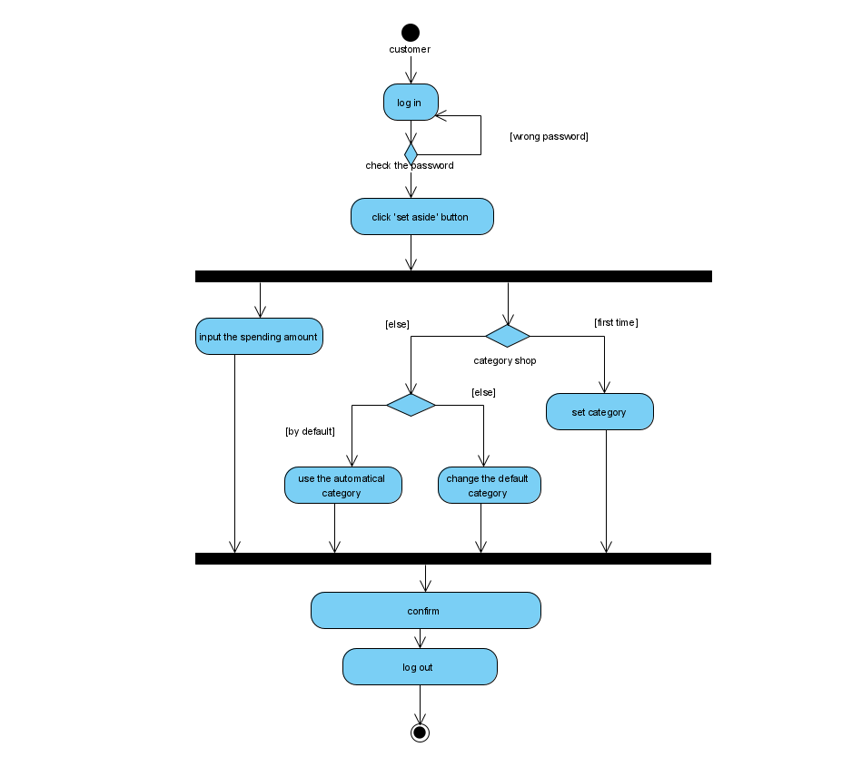

# Activity Diagram

# Explaination
## Introduction
This diagram helps us to better understand how the whole process works and how the other diagrams work, they are similar in terms of process, although the content is not the same.

## Analysis
The use case we choose is our actors record their spending which is in the 'set aside' type. For the "Set 'set aside'" use case, our activity diagram illustrates the steps and actors that are involved. At first, **Single-account-single-customers**, **Multi-account-users** and **Joint-account users** (Actor) (and we conclude all of them as **customer**) need to **log in** the system. And if the password is incorrect. The actor need to return to input the password again. Then the customer **click "set aside" button** (Activity) .There are two activities that customer should do at one time. The first one is **input the spending amount** (Activity) and the other is **category the shop**(Activity). If customer use it for the first time, he should **set category** of the shop. Otherwise, there will be a default category of the shop. If customer want to change the defaulf category, he should **change the default category** (Activity). Otherwise, he would **use the automatical category** (Activity). After all the previous activities have finished, customer should **confirm** (Activity) and **log out** (Activity) the system.

## Reasonings
- The "**Set 'set aside'**" use case means our actors record their spending which is in the 'set aside' type.

- Because all **Single-account-single-customers**, **Multi-account-users** and **Joint-account users** could use the function 'set aside', then wo got all of the three as our actors in this activity diagram, and we conclude as **customer**

- This "**Set 'set aside'**" use case also include the use cases which are **Set spending categorise** and **Change default categorise** because in this activity, if our actors want to record their spending, they also need the step to set the category at first time (and sometimes need to change the default category). 

