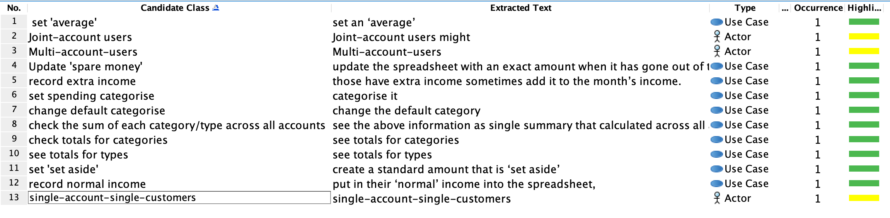
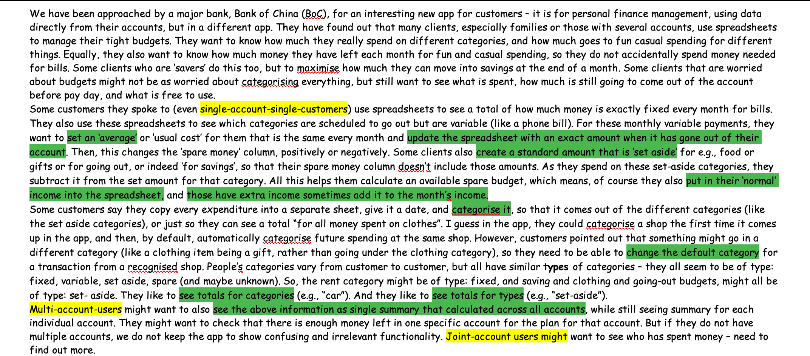

# Textual Analysis
## Textual Analysis in Visual Paradigm

## Explaination
### Actor Chosen Explanation:
We choose this following **three** as our actors
- **single-account-single-customers**
- **Multi-account-users**
- **Joint-account users**
According to the requirements brief, the customers were roughly be divided into thress types, which are **single-account-single-customers**, **Multi-account-users** and **Joint-account users** as our **three** actors.
### Use Case Analysis
We choose this following **nine** as our use cases
- **set fixed bills**
We choose this as one of use case is because some customers want to see a total of how much money is exactly fixed every month for bills.
- **set 'average'**
We choose this as one of use case is because some customers wnat to see the variable categories that spent every month like phone bill, and for thiese monthly payments, they want to set an 'usual average' is same every month.
- **Update the spare money**
We choose this as one of use case is because when customers have these variable payments, the spare money will changes positively or negatively.
- **set 'set aside'**
We choose this as one of use case is because some customers want to create a standard amount that is ‘set aside’ for e.g., food or gifts or for going out, or indeed ‘for savings’. Therefore, their spare money column doesn’t include those amounts.
- **record normal income**
- **record extra income**
We choose these as two of use case is because customers will have normal income and have extra income somtimes add it to the month's income.
- **set spending categorise**
We choose this as one of use case is because some customers like to categorise evert expenditure. Therefore this app cpuld help to categorise a shop the first time it comes up in the app, and then, by default, automatically categorise future spending at the same shop.
- **change default categorise**
We choose this as one of use case is because sometimes something might go in a different category , for example, a clothing item being a gift, rather than going under the clothing category. So they want to change the default category for a transaction from a recognised shop.
- **check totals for catefories**
We choose this as one of use case is because customers like to see totals for categories (e.g., “car”).
- **check totals for types**
We choose this as one of use case is totals for types (e.g., “set-aside”).
- **check sum of each category/type accross all accounts**
We choose this as one of use case is because multi-account-users want to see the sum of each category/type accross all accounts
- **check who has spent money**
We choose this as one of use case is because multi-account-users want to see summary for each individual account.

# Personas
- [Persona_father](docs/Persona_father.md)
- [Persona_student](docs/Persona_student.md)
- [Persona_unemployed](docs/Persona_unemployed.md)

# Users Stories
- [User Stories](docs/UserStories.md)

