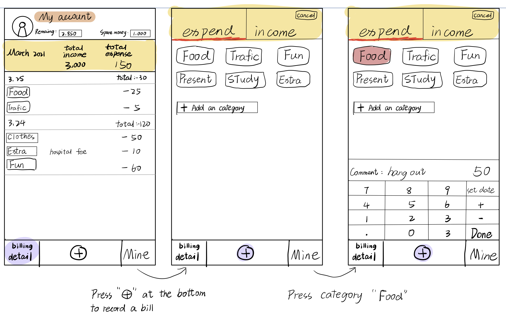
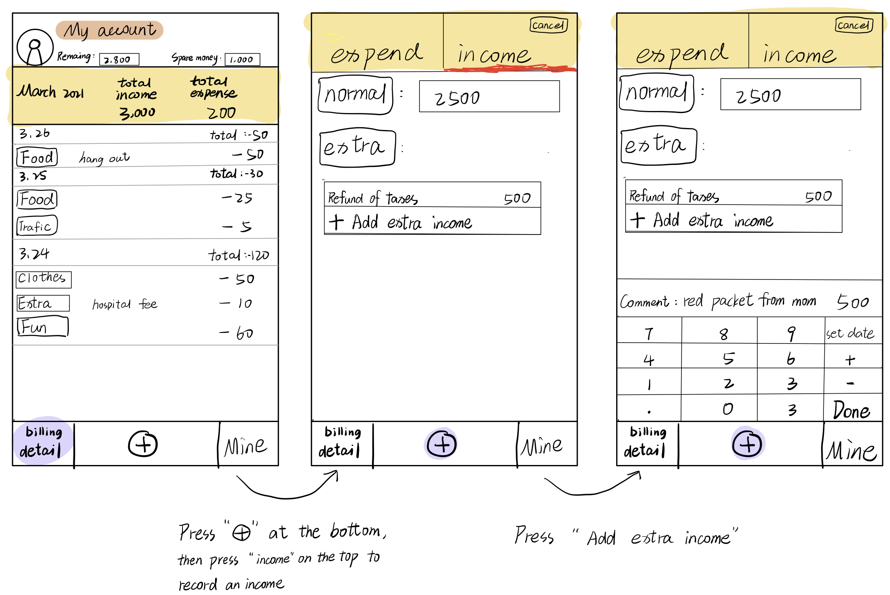
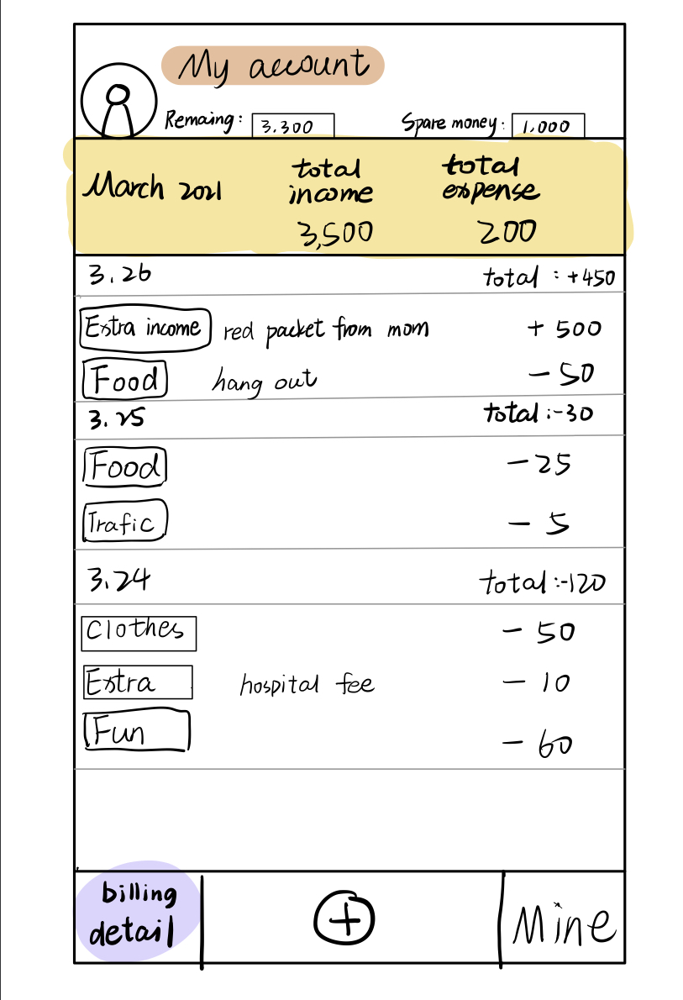

# Activity Diagram
- [Activity Diagram](docs/ActivityDiagram.md)

# Prototype

## analysis
Here we show the process of a user recording a new expence in category "Food" with a comment "hang out", and recording an extra income with a comment "red packet from mom".

# Scenarios
- [Scenarios](docs/Scenarios.md)