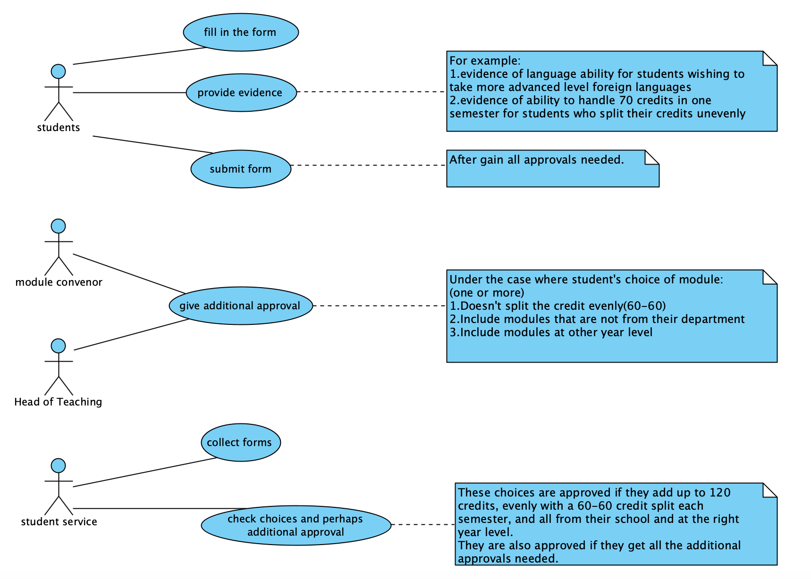

# Explanation
We got **four** actors, **students**, **student service**, **module convenor** and **head of teaching**. 

At the moment, student have to collect a form from student services and write their choices on the form. Thus we got a use cases named **fill in the form**.

However, there are many cases, where additional approval is required. First, in some cases, student need to provide some evidences. For example, the evidence of language ability for students wishing to take more advanced level foreign languages or ablity to handle 70 credits in one semester for students split their credits unevenly. Thus we got a use case named **provide evidence**. Second, in these cases, 1) doesn't split the credit evenly(60-60), 2) include modules that are not from their department and 3) include modules at other year level, students need to get the approval from module convenor and head of teaching. Thus we got a use cases named **give additional approval**.

 After gain all needed approvals, students could submit form to the student service, thus we got the use cases named **submit form**. Then the student service will colloect the form and check students' chocice and perhaps additional approval. Thus we got two use cases named checked **collect form** and **check chocies and perhaps additional approval**. And if a student's choices add up to 120 credits, evenly with a 60-60 credit split each semester, and all from their school and at the right year level or get additional approvals, these choices will be approved by student services.

# Lab02 Use Case Diagram

