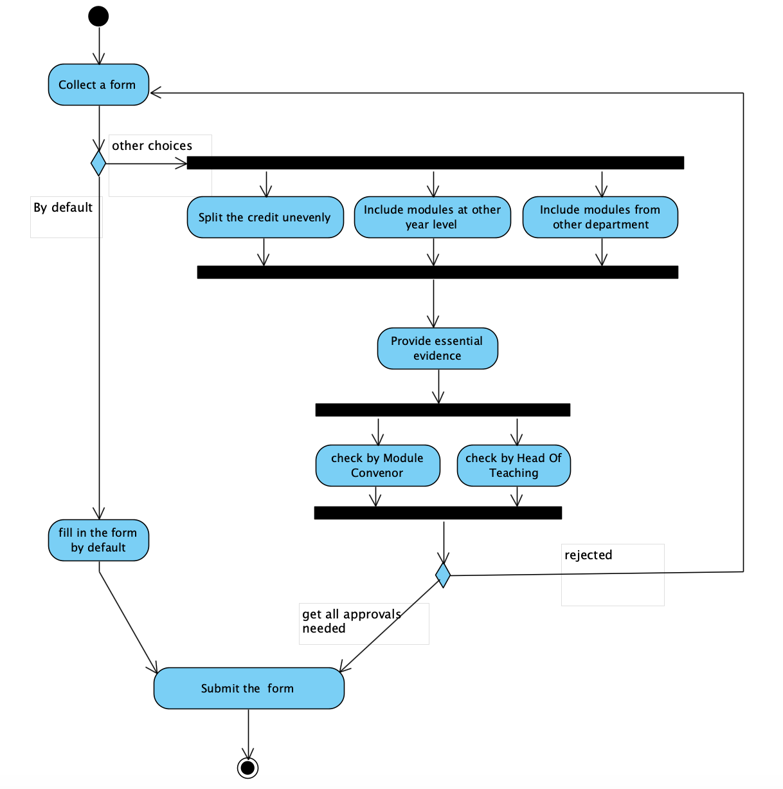
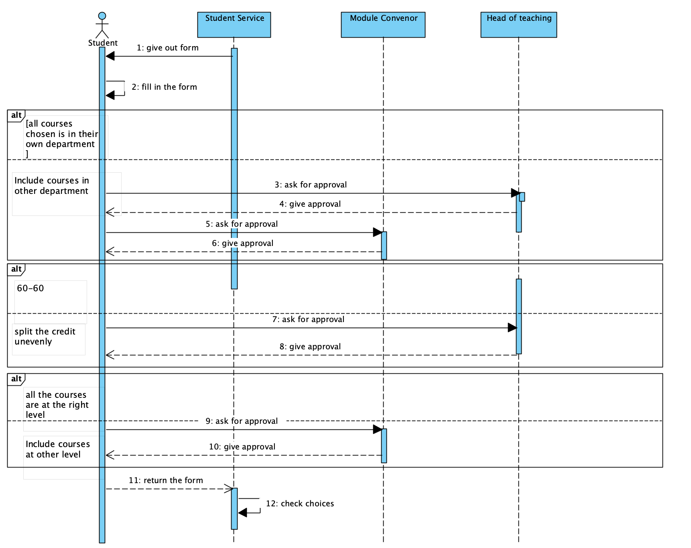

# Activity Diagram and Sequence Diagram

## Introduction

In order to design a software to give assistant to the Student Service, we used both activity diagram and sequence diagram in lab3 to illustrate and analysis the case for the students who need to choose courses in university, which may includes some cases which need further approval.For example, taking more advance level foreign languages, spliting the credits unevenly and take an introduction module from other department.

Activity diagram is usually used to show the key decision which involve decisions in the form of workflow. It can clearly explain the process of the activities, decision points and the parallel work. For instance, the choices which students want to apply are different but happend in a parallel way. By using the activity diagram, we can clearly elaborate where represents the split point and where represents the join point of the concurrent activities.

Sequence diagram is usually used to explain the complex sharing of information between different actors. For example, in this case, there are four different actors: Students, Student Service, Module Convenor and the Head of Teaching. Using the sequence diagram, we can see a series of sequential activities between key actors. The main sequence of this case is that students collect the form the Student Service, fill the form, ask for the approval to the moudle convenor or the head of teaching, and finally return the form.

## Activity Diagram

### Why choose Activity Diagram
An activity diagram describes the activities that need to be done and the order in which those activities need to be performed. When representing concurrent processes as activities, activity diagrams give us the freedom to choose the order in which we do things.

### Image of Activity Diagram

### Explanation of Activity Diagram
**Students** are the main actors in the whole process, so we choose it as the starting point. First of all, **collect the forms** as required, which is a necessary condition for starting all of the following processes. The whole requirement is about the course selection in some special cases and the default. The rest of the requirements are about course selection under default and special circumstances, so use "Decision Node" to distinguish between default and special cases. Under the default condition, students can directly enter the submission process without other additional conditions. On the whole, we have three types of special cases, and they may appear singlely or in combination in the real world. And these situations can be put together with "Fork Node". The first special condition like "50-70 credit split" can summed up in "Split the credit unevenly", which need to be approved from the Head of Teaching. "a student wishes to take an introductory module from another department" and other similar requestions can be summed up in "Include modules from other department", and it needs to get approval from the module convenor of that module or  the Head of Teaching in their own school.The last one "Students wishing to take more advanced level foreign languages" can be summed in "Include modules at other year level", which also needs approval. By using "Join Node", the next step of these three activities can be the same : "Provide essential evidence". Students need to provide evidence to prove that they are capable of accomplishing these special situations. Then, these evidence will be checked by Module Convenor and Head Of Teaching. If students get approvals, they can submit it. Otherwise, they have to rewrite it.

## Sequence Diagram

### Why choose this Sequence Diagram
The Sequence diagram could help us to understand the how the actor communicate with objects(i.e.how the message be receive and sent) and the order in which the message sent

### Image of Sequence Diagram

### Explaination of Sequence Diagram
We choose the process of submit diagram to write the sequence. First, *student* need to receive the from *student service*(i.e. **student service give out the form**) and then **fill in the form**. Then, if the *student* want to take courses in other department, he/she should **ask for approval** from *head of teaching* and *module convenor*. If the student spilt credit unevenly (for example,50-70), *student* should **ask for approval** from *head of teaching*. And if the *student* want to include courses at other level, he/she should **ask for approval** from *module convenor*. After sending all the request message, *Head of teaching* or *Module convenor* or both will **give approval** message(assume in this situation). After receiving all approval, the *student* could **return the form** to *student service* and then the *student service* will check the choices.

